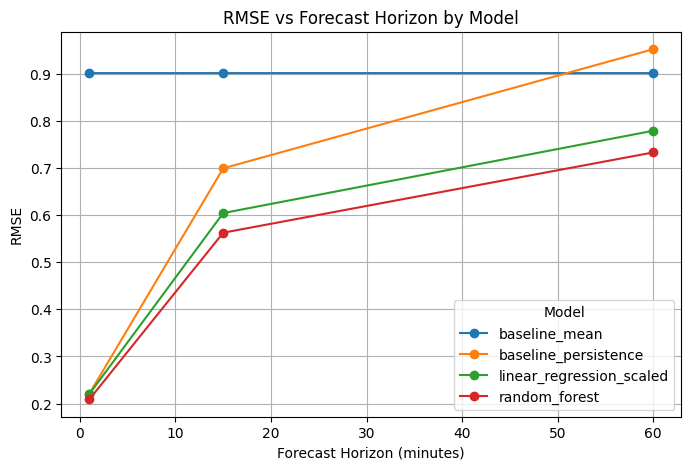
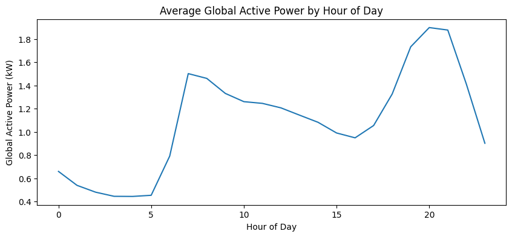
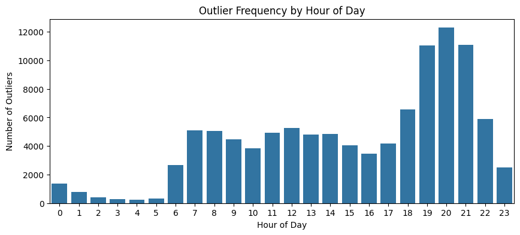

# Household Electricity Consumption Forecasting

Short-term electricity demand looks predictable until the forecast window starts to widen.

At a one-minute horizon, the most recent reading carries a lot of information. But that advantage fades quickly as the prediction target moves farther out. This project asks a practical forecasting question:

**When is a simple baseline enough, and when does a feature-based model add useful signal for household electricity planning?**

To answer it, I built a reproducible Python time-series pipeline, evaluated multiple forecast horizons, and translated the results into a compact Vercel dashboard designed for portfolio review.

**Live dashboard:** https://householdelectricconsumptionanalysi.vercel.app  
**Repository:** https://github.com/JoshuaColePhD/Household_Electric_Consumption_Analysis

[](https://householdelectricconsumptionanalysi.vercel.app)

*Forecast error increases as the horizon expands. Open the dashboard for interactive model, horizon, and scenario views.*

## The Story

Imagine a household energy platform trying to estimate near-term demand. For the next minute, the easiest answer is often the last observed value. That persistence baseline is simple, cheap, and hard to beat when consumption is highly autocorrelated.

But operational decisions rarely stop at the next minute.

As the horizon moves to 15 or 60 minutes, appliance cycles, household routines, and high-demand events begin to matter more. A model has to learn temporal structure instead of merely repeating the present.

That is the core of this project: compare strong baselines against machine-learning models across practical horizons, then make the tradeoffs easy to inspect in a public dashboard.

## What the Analysis Found

Random Forest produced the lowest RMSE across the evaluated horizons, while persistence remained highly competitive at one minute. The main modeling lesson is not that one algorithm wins everywhere. It is that model value depends on the forecast window.

| Horizon | Persistence RMSE | Linear Regression RMSE | Random Forest RMSE | Interpretation |
| ---: | ---: | ---: | ---: | --- |
| 1 min | 0.22 | 0.22 | **0.21** | Persistence is a demanding near-term benchmark. |
| 15 min | 0.70 | 0.60 | **0.56** | Feature-based models begin to separate from simple carry-forward logic. |
| 60 min | 0.95 | 0.78 | **0.73** | Nonlinear temporal features retain more predictive power. |

The dashboard frames these results in business language: short-horizon forecasts are useful for immediate monitoring, while wider horizons require more modeling structure and clearer uncertainty communication.

## The Dashboard

**Open the live dashboard:** https://householdelectricconsumptionanalysi.vercel.app

The dashboard is a static Vercel app with a darker executive-BI design system inspired by the companion HR attrition project. It is intentionally lightweight: committed summary artifacts power the public interface, while large raw and intermediate datasets stay out of git.

Dashboard features:

- Forecast horizon controls for 1-, 15-, and 60-minute targets
- Model selector for Random Forest, scaled linear regression, persistence, and mean baselines
- KPI cards for selected MAE, RMSE, and R²
- Interactive bar chart for selected-horizon model comparison
- Interactive RMSE degradation chart across forecast horizons
- Scenario framing for typical rhythm, evening spikes, and overnight load
- Static visual modules for time-of-day consumption and outlier timing
- Methodology strip from raw UCI measurements to deployable analytics

## Methodology

### Data

| Attribute | Value |
| --- | --- |
| Source | UCI Individual Household Electric Power Consumption dataset |
| Unit of analysis | Minute-level household electricity reading |
| Observations | About 2.0 million measurements |
| Target | Future global active power |
| Forecast horizons | 1, 15, and 60 minutes |

Key variables include global active power, global reactive power, voltage, global intensity, appliance sub-metering, and timestamp-derived temporal features.

### Workflow

1. **Load and clean.** Validate schema, parse timestamps, normalize numeric fields, handle missing values, and flag outliers.
2. **Explore consumption patterns.** Inspect daily, weekly, hourly, and outlier timing behavior.
3. **Engineer features.** Create calendar, lag, rolling-window, and outlier-context features.
4. **Model forecasts.** Evaluate persistence, mean baseline, scaled linear regression, and random forest models.
5. **Compare horizons.** Report MAE, RMSE, and R² across 1-, 15-, and 60-minute targets using time-aware validation.
6. **Productize results.** Export small CSV/figure artifacts for a fast Vercel dashboard.

## Key Visual Findings

Household electricity consumption has a clear daily rhythm, with lower overnight usage and higher demand during active household hours.



High-demand outliers are retained and flagged rather than removed because they can represent real household behavior such as cooking, heating, or appliance cycles.



## Reproducing the Project

### Run the Python Pipeline

```bash
python -m venv .venv
source .venv/bin/activate
pip install -r requirements.txt

python src/00_load_and_clean.py
python src/01_eda.py
python src/02_features.py
python src/03_modeling.py
python src/04_evaluation.py
```

### Build the Dashboard

```bash
npm install
npm run build
```

### Preview Locally

```bash
npm run dev
```

Open `http://localhost:5173`.

## Vercel Deployment

The deployment is intentionally simple:

- Vercel runs `npm run build`.
- `scripts/build-static.mjs` copies `index.html`, `assets/`, `figures/`, and `data/` into `dist/`.
- `vercel.json` serves `dist/` as the static output directory.
- Raw data, processed feature tables, virtual environments, and local build artifacts remain excluded.

This keeps the public dashboard fast, portable, and appropriate for a portfolio repository.

## Project Structure

```text
HOUSEHOLD_ELECTRIC_CONSUMPTION_ANALYSIS/
├── assets/                 # dashboard CSS and JavaScript
├── data/                   # committed model/evaluation summary artifacts
├── figures/                # exported plots used in README and dashboard
├── scripts/                # static Vercel build script
├── src/                    # Python analysis pipeline
├── index.html              # static dashboard entrypoint
├── package.json
├── requirements.txt
├── vercel.json
└── README.md
```

## Portfolio Skills Demonstrated

- Time-series data cleaning and validation
- Missing-value handling and outlier flagging
- Feature engineering with lags, rolling statistics, and calendar signals
- Baseline-aware forecasting
- Leakage-conscious model evaluation
- Multi-horizon performance comparison
- Interactive analytics dashboard design
- Static Vercel deployment for public portfolio review
